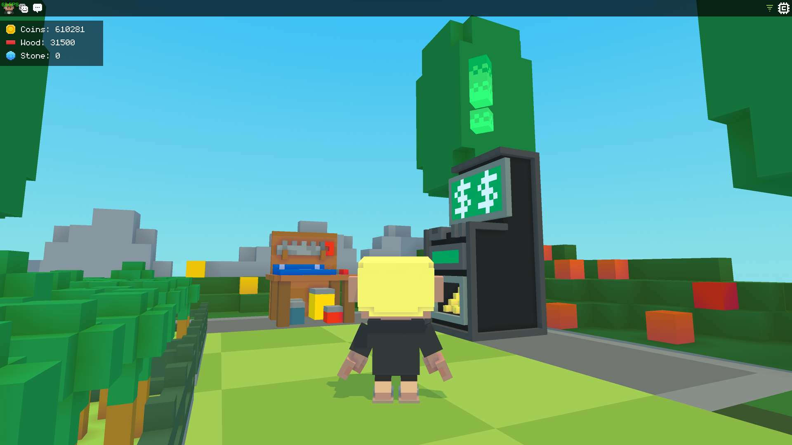
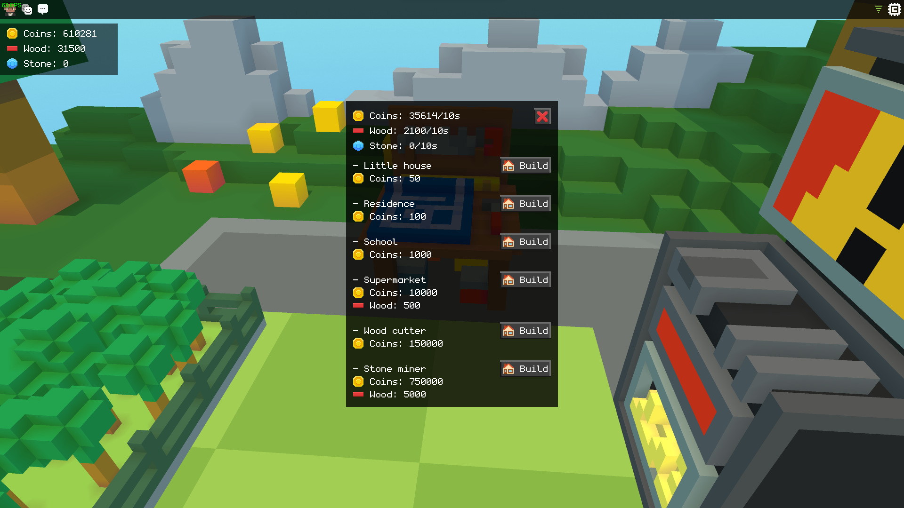
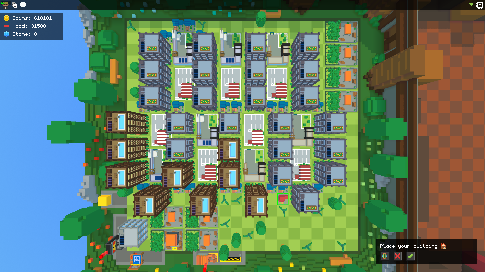
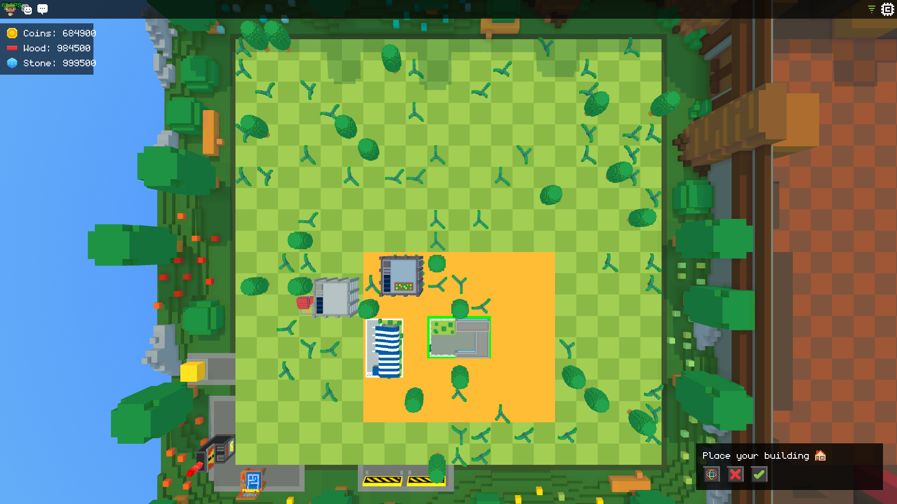

# CityTycoon

🟪 Cubzh game - City Tycoon is a 3D Vexel game where you create your own city. Develop your population and earn money by making them as happy as possible. Game deveoped in lua

This game was developed in 3 days by [@math](https://github.com/tekmath) 💻\
All voxel designs were produced by [@drouethug](https://github.com/drouethug) ✏️

The game is developed on the Cubzh engine, available on Steam and EpicGame.
Documentation is available here: https://docs.cu.bzh/

Join the game with the link https://app.cu.bzh/?worldID=a98f64ac-2e1f-44ae-9361-48b4e3eb475b

### Screens

